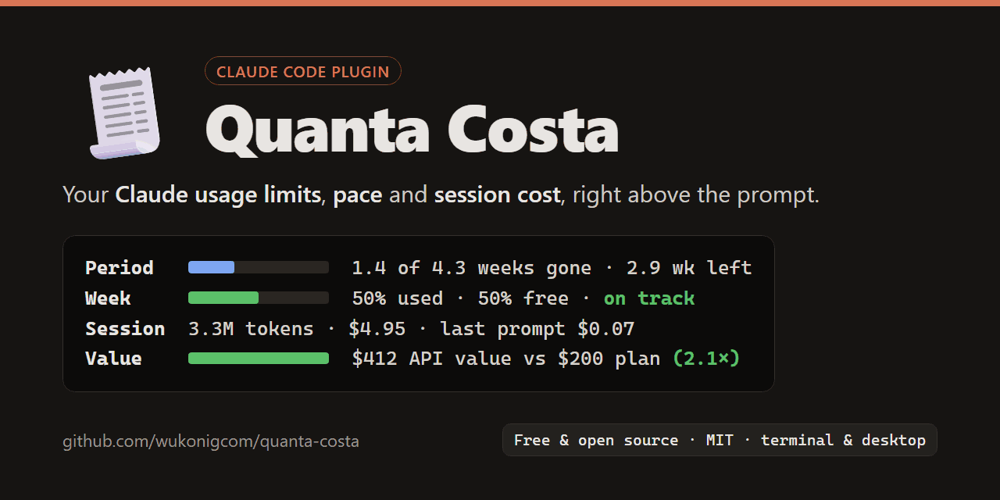

# 🧾 Quanta Costa: Claude Code usage limits and session cost, right above the prompt

[](LICENSE)
[](https://claude.com/claude-code)



**How much of your Claude plan is left, and what is this session costing you?**
Quanta Costa is a [Claude Code](https://claude.com/claude-code) plugin that answers both at a glance. It shows your **billing period**, your **weekly usage limit** with a **pace forecast**, the **cost of the current session** in tokens and dollars or euros, and whether your **plan pays off**, as a compact band right above the prompt. It works in the terminal and in the Claude desktop app.

```
🧾 Period   ████░░░░░░░░  1.4 of 4.3 weeks gone · 2.9 wk left · renews in 20 days
   Week     ██████░░░░░░  50% used · 50% free · on track (resets Oct 12)
   Session  3.3M tokens · $4.95 · last prompt $0.07 · 85k tokens   [Help]
   Value    ████████████  $412.30 API value vs $200.00 plan (2.1×)
```

## Features

- **Weekly limit bar** for Claude Pro and Max: how much is used, how much is free, when it resets. Green, yellow from 70%, red from 90%.
- **Pace forecast**: know before you hit the limit. "on track" if your week lasts until the reset, otherwise "runs out Fri 14:00".
- **Plan value**: the API value of all your sessions this period against your plan price, e.g. `2.1×`. Above 1× your subscription has paid for itself.
- **Billing period bar**: how many weeks of the month you paid for are gone and how many are left.
- **Session cost** in tokens and in dollars or euros, plus the cost of your **last prompt**. Updates live after every tool call.
- **5-hour limit warning**: the short-term window only shows up when it passes 80%, with the time it frees up again.
- **Built-in help**: one click explains every number, including whether the costs are real.
- **English or German**: switch the language with one setting, numbers and dates follow (`4,42 €`, `12.10.`).
- **Private by design**: no network calls. All numbers come from Claude Code itself; the Value row keeps a small local ledger of session costs in the plugin's own store on your machine.

## Install

Type this at the prompt of a Claude Code session in your terminal:

```
/plugin install quanta-costa --marketplace wukonigcom/quanta-costa
```

Answer `y` to add the marketplace, pick the **user** scope with Enter, then set the options. A plugin installed for the user scope also runs in the Claude desktop app (Code tab).

## Settings

| Setting | What it does | Default |
| --- | --- | --- |
| `language` | `en` (English) or `de` (German): labels, help, number and date formats | `en` |
| `billingDay` | Day of the month your subscription renews (1 to 31). It is on your Anthropic receipt. `0` hides the Period row. | `0` |
| `currency` | `USD` or `EUR` | `USD` |
| `eurRate` | Euros per US dollar, used with `EUR` | `0.89238` (ECB, 2026-10-09) |
| `planPrice` | Your monthly plan price in your currency, as on your receipt. Turns on the Value row. `0` hides it. | `0` |

Change them later with `/plugin configure quanta-costa` in Claude Code or `claude plugin configure quanta-costa` in a shell.

## FAQ

**Are the costs real?**
On a Claude subscription (Pro or Max): no, they are hypothetical. Quanta Costa shows what the session would cost at API list prices, the same figure `/cost` totals. You do not pay it on top; it only counts against your weekly allowance. You only really pay for extra usage beyond your limit, if you turned it on. On an API key, Claude Code reports no subscription limits, and the help says the costs are real.

**What are the weekly limit and the 5-hour limit?**
Claude plans meter usage in two windows: a weekly allowance and a short 5-hour window. Quanta Costa shows the weekly one as a bar and only warns about the 5-hour one when it gets tight, because that is the one that usually stops you.

**How does the pace forecast work?**
It extrapolates your usage so far in the current week: if you keep going at the same rate, when would you hit 100%? If that is after the reset, you are on track. It waits until a few hours of the week have passed, so it does not guess from too little data.

**How is the plan value calculated?**
Each session books its API-equivalent cost to the current billing period (or calendar month without `billingDay`) in a small ledger on your machine. The Value row adds up all sessions of the period and divides by `planPrice`. Only sessions where Quanta Costa ran are counted, so the real value is usually higher.

**Why is there no Period row?**
Claude Code does not know your billing date. Set `billingDay` once and the row appears.

**Why do the tokens start at zero mid-session?**
Tokens are summed from the moment the plugin loads. The dollar or euro amount always covers the whole session.

**Does it send my data anywhere?**
No. It reads Claude Code's own usage figures through the plugin API and draws them. The value ledger stays in the plugin's local store. Nothing leaves your machine.

**How is it different from ccusage?**
[ccusage](https://github.com/ryoppippi/ccusage) analyses Claude Code's log files after the fact, from the command line. Quanta Costa lives inside Claude Code and shows the live numbers while you work.

## Requirements

Claude Code 2.1.293 or newer. Quanta Costa uses Claude Code's function-hooks plugin API, which is in early access and may change between releases.

## Deutsch

Quanta Costa zeigt in Claude Code direkt über dem Prompt, wie viel von deinem Claude-Abo noch frei ist (Woche und Abrechnungsperiode als Balken), ob deine Woche bei diesem Tempo reicht, was die laufende Sitzung in Tokens und Euro kosten würde und ob sich dein Abo lohnt. Mit Abo sind die Kosten theoretisch: Sie zählen nur gegen dein Wochenkontingent. Installation wie oben. Für die deutsche Oberfläche `language` auf `de` stellen, für Euro `currency` auf `EUR`, `billingDay` auf deinen Abrechnungstag und `planPrice` auf deinen Abo-Preis.

## License

MIT, see [LICENSE](LICENSE). Made by Jörg Wukonig, [Wukonig & Partner](https://wukonig.com).
